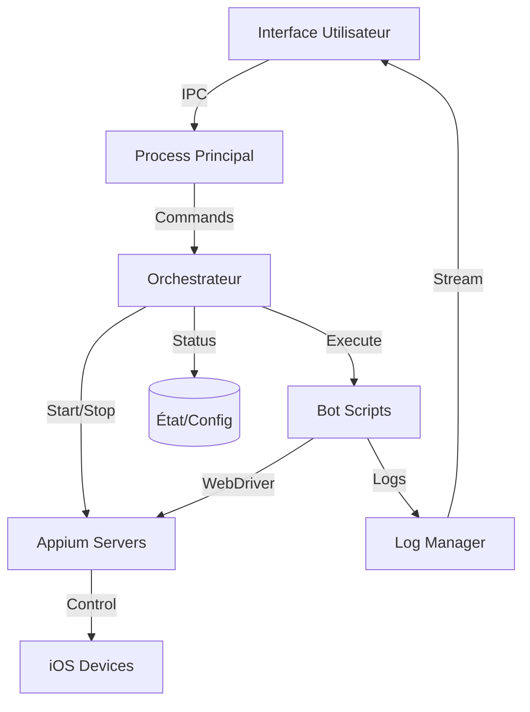

# Architecture Technique - Plateforme d'Automatisation iOS Multi-Appareils

## 🎯 Vue d'ensemble

Cette plateforme est conçue comme un système modulaire et scalable pour l'automatisation iOS multi-appareils, avec une séparation claire entre l'interface de contrôle, l'orchestration, et les projets d'automatisation.

## 📁 Structure Proposée

```
AUTOMATION-PLATFORM/
│
├── UI/                           # Interface de contrôle desktop (Electron)
│   ├── src/
│   │   ├── main/                # Process principal Electron
│   │   │   ├── index.js
│   │   │   ├── ipc/             # Handlers IPC organisés
│   │   │   │   ├── device.ipc.js
│   │   │   │   ├── appium.ipc.js
│   │   │   │   ├── bot.ipc.js
│   │   │   │   └── project.ipc.js
│   │   │   ├── services/        # Services backend
│   │   │   │   ├── DeviceManager.js
│   │   │   │   ├── AppiumManager.js
│   │   │   │   ├── ProcessManager.js
│   │   │   │   └── LogManager.js
│   │   │   └── utils/
│   │   │
│   │   ├── renderer/            # Interface utilisateur
│   │   │   ├── index.html
│   │   │   ├── app.js
│   │   │   ├── components/      # Composants UI modulaires
│   │   │   │   ├── DeviceCard/
│   │   │   │   ├── LogViewer/
│   │   │   │   ├── StatusBar/
│   │   │   │   └── ControlPanel/
│   │   │   ├── services/        # Services frontend
│   │   │   │   ├── api.js
│   │   │   │   ├── websocket.js
│   │   │   │   └── state.js
│   │   │   └── styles/
│   │   │
│   │   └── preload/
│   │       └── index.js
│   │
│   ├── assets/                  # Ressources statiques
│   ├── config/                  # Configuration UI
│   └── package.json
│
├── ORCHESTRATOR/                # Orchestrateur central
│   ├── src/
│   │   ├── core/               # Logique métier principale
│   │   │   ├── DeviceOrchestrator.js
│   │   │   ├── SessionManager.js
│   │   │   ├── PortAllocator.js
│   │   │   └── ProjectLoader.js
│   │   │
│   │   ├── drivers/            # Drivers pour services externes
│   │   │   ├── AppiumDriver.js
│   │   │   ├── WDADriver.js
│   │   │   └── IOSDriver.js
│   │   │
│   │   ├── queues/             # Gestion des files d'attente
│   │   │   ├── TaskQueue.js
│   │   │   └── JobScheduler.js
│   │   │
│   │   └── monitoring/         # Surveillance et métriques
│   │       ├── HealthChecker.js
│   │       ├── MetricsCollector.js
│   │       └── AlertManager.js
│   │
│   ├── config/                 # Configurations orchestrateur
│   │   ├── default.json
│   │   ├── production.json
│   │   └── development.json
│   │
│   └── package.json
│
├── PROJECTS/                   # Projets d'automatisation isolés
│   ├── HINGE/                 # Projet Hinge
│   │   ├── src/
│   │   │   ├── flows/         # Flux d'automatisation
│   │   │   │   ├── onboarding.js
│   │   │   │   ├── account-creation.js
│   │   │   │   └── interaction.js
│   │   │   ├── providers/     # Fournisseurs de services
│   │   │   │   ├── sms/
│   │   │   │   ├── email/
│   │   │   │   └── proxy/
│   │   │   └── utils/
│   │   ├── config/
│   │   ├── data/
│   │   └── package.json
│   │
│   ├── TINDER/                # Projet Tinder (futur)
│   └── BUMBLE/                # Projet Bumble (futur)
│
├── SHARED/                    # Modules partagés
│   ├── libs/                  # Bibliothèques communes
│   │   ├── webdriver-helper/
│   │   ├── ios-utils/
│   │   └── logger/
│   ├── types/                 # Types TypeScript partagés
│   └── constants/
│
├── INFRASTRUCTURE/            # Scripts d'infrastructure
│   ├── scripts/
│   │   ├── setup.sh          # Installation initiale
│   │   ├── cleanup.sh        # Nettoyage des ressources
│   │   └── health-check.sh   # Vérification santé
│   ├── docker/               # Conteneurisation (optionnel)
│   └── k8s/                  # Kubernetes (futur)
│
├── TESTS/                    # Tests globaux
│   ├── e2e/                  # Tests end-to-end
│   ├── integration/          # Tests d'intégration
│   └── performance/          # Tests de performance
│
├── DOCS/                     # Documentation
│   ├── API.md
│   ├── SETUP.md
│   ├── TROUBLESHOOTING.md
│   └── CONTRIBUTING.md
│
├── .github/                  # CI/CD
│   └── workflows/
│
├── package.json              # Package racine (monorepo)
├── lerna.json               # Configuration Lerna pour monorepo
└── README.md
```

## 🏗️ Architecture en Couches

### 1. **Couche Présentation (UI)**
- **Technologie**: Electron + React/Vue (à considérer)
- **Responsabilités**:
  - Affichage des appareils connectés
  - Contrôles de démarrage/arrêt
  - Visualisation des logs en temps réel
  - Gestion des paramètres
- **Communication**: WebSocket + IPC

### 2. **Couche Orchestration**
- **Technologie**: Node.js
- **Responsabilités**:
  - Gestion du cycle de vie des sessions Appium
  - Allocation dynamique des ports
  - Coordination multi-appareils
  - File d'attente des tâches
- **Patterns**: Event-Driven, Command Pattern

### 3. **Couche Projet**
- **Structure**: Modules isolés par application cible
- **Responsabilités**:
  - Logique métier spécifique à l'app
  - Flux d'automatisation
  - Gestion des providers (SMS, email, proxy)
- **Patterns**: Strategy Pattern, Factory Pattern

### 4. **Couche Infrastructure**
- **Services**:
  - Appium Server Management
  - WebDriverAgent Management
  - iOS Device Communication
  - Port Management
- **Patterns**: Service Layer, Repository Pattern

## 🔄 Flux de Données



## 🔌 Modules Clés

### DeviceManager
```javascript
class DeviceManager {
  - detectDevices()
  - getDeviceInfo(udid)
  - monitorConnection()
  - allocatePorts(device)
}
```

### SessionOrchestrator
```javascript
class SessionOrchestrator {
  - createSession(device, project)
  - startAppiumServer(config)
  - startWDA(device)
  - executeBot(session)
  - terminateSession(sessionId)
}
```

### ProjectLoader
```javascript
class ProjectLoader {
  - loadProject(name)
  - getProjectConfig()
  - getFlows()
  - getProviders()
}
```

### LogAggregator
```javascript
class LogAggregator {
  - addSource(name, stream)
  - filterByDevice(udid)
  - filterByLevel(level)
  - stream(callback)
}
```

## 🔐 Gestion de l'État

### État Global
```javascript
{
  devices: Map<udid, DeviceState>,
  sessions: Map<sessionId, SessionState>,
  projects: Map<name, ProjectConfig>,
  metrics: {
    global: MetricsData,
    perDevice: Map<udid, MetricsData>
  }
}
```

### État par Appareil
```javascript
{
  udid: string,
  name: string,
  model: string,
  ios: string,
  status: 'disconnected' | 'ready' | 'running' | 'error',
  session: {
    appiumPort: number,
    wdaPort: number,
    pid: number,
    startTime: Date,
    project: string
  },
  stats: {
    accountsCreated: number,
    successRate: number,
    lastError: string
  }
}
```

## 📊 Patterns et Best Practices

### 1. **Separation of Concerns**
- Chaque couche a une responsabilité unique
- Communication via interfaces bien définies
- Dépendances unidirectionnelles

### 2. **Event-Driven Architecture**
- Communication asynchrone entre composants
- Event bus pour les notifications globales
- WebSocket pour les mises à jour temps réel

### 3. **Resilience Patterns**
- Circuit Breaker pour les services externes
- Retry avec backoff exponentiel
- Graceful degradation
- Health checks réguliers

### 4. **Scalability Patterns**
- Worker pool pour l'exécution parallèle
- Queue management pour les tâches
- Resource pooling (ports, sessions)
- Horizontal scaling ready

## 🚀 Phases de Développement

### Phase 1: Foundation (Actuelle)
- [x] Interface de base
- [ ] DeviceManager basique
- [ ] Intégration Appium simple
- [ ] Logs en temps réel

### Phase 2: Orchestration
- [ ] SessionOrchestrator complet
- [ ] Gestion multi-appareils robuste
- [ ] Queue management
- [ ] Métriques basiques

### Phase 3: Modularisation
- [ ] Système de plugins pour projets
- [ ] Hot-reload des projets
- [ ] Configuration dynamique
- [ ] API REST

### Phase 4: Production
- [ ] Monitoring avancé
- [ ] Alerting
- [ ] Auto-recovery
- [ ] Dashboard analytics

### Phase 5: Scale
- [ ] Distributed mode
- [ ] Cloud integration
- [ ] Container support
- [ ] CI/CD pipelines

## 🔧 Stack Technologique Recommandée

### Backend
- **Runtime**: Node.js 20+ LTS
- **Framework**: Express/Fastify pour API
- **WebSocket**: Socket.io
- **Queue**: Bull/BullMQ
- **ORM**: Prisma (si DB nécessaire)
- **Logger**: Winston/Pino

### Frontend
- **Framework**: Electron + React/Vue
- **State**: Zustand/Pinia
- **UI Library**: Ant Design/Element Plus
- **Charts**: Chart.js/D3.js
- **Build**: Vite

### DevOps
- **Container**: Docker
- **Orchestration**: Docker Compose → Kubernetes
- **CI/CD**: GitHub Actions
- **Monitoring**: Prometheus + Grafana
- **Logs**: ELK Stack

### Testing
- **Unit**: Jest/Vitest
- **Integration**: Supertest
- **E2E**: Playwright
- **Performance**: K6

## 📝 Conventions de Code

### Naming
- **Classes**: PascalCase (`DeviceManager`)
- **Methods**: camelCase (`startSession`)
- **Constants**: UPPER_SNAKE (`MAX_RETRIES`)
- **Files**: kebab-case (`device-manager.js`)

### Structure
```javascript
// Module pattern
class ModuleName {
  constructor(dependencies) {}

  // Public methods
  async publicMethod() {}

  // Private methods
  #privateMethod() {}

  // Static methods
  static utilityMethod() {}
}

// Export
module.exports = ModuleName;
```

### Error Handling
```javascript
class CustomError extends Error {
  constructor(message, code, details) {
    super(message);
    this.code = code;
    this.details = details;
  }
}

// Usage
try {
  await riskyOperation();
} catch (error) {
  logger.error('Operation failed', { error, context });
  throw new CustomError('User-friendly message', 'ERR_CODE', { ...details });
}
```

## 🎯 Objectifs de Qualité

1. **Maintenabilité**: Code modulaire et bien documenté
2. **Fiabilité**: Tests > 80% coverage
3. **Performance**: < 100ms latence UI
4. **Scalabilité**: Support 50+ appareils
5. **Observabilité**: Logs structurés et métriques complètes

## 🔮 Vision Future

- **Multi-plateforme**: Support Android
- **Cloud-native**: Déploiement SaaS
- **AI-powered**: Détection automatique d'anomalies
- **Marketplace**: Partage de projets/flows
- **API publique**: Intégration tierce